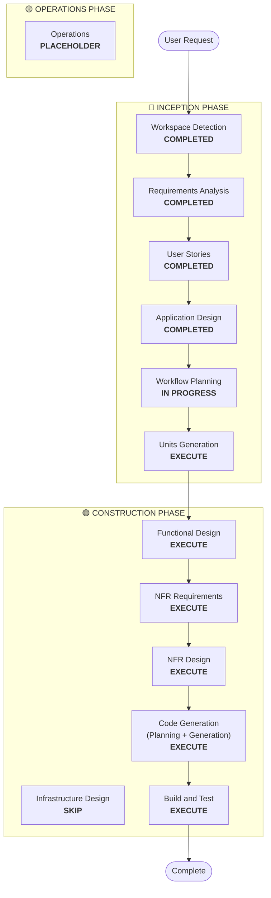

# Execution Plan: Payroll Module

## Detailed Analysis Summary

### Transformation Scope (Brownfield Only)
- **Transformation Type**: Architectural (Modularization)
- **Primary Changes**: Extracting Payroll and Attendance logic from `:feature:dashboard` and `:feature:ricemill` into a standalone `:feature:payroll` module.
- **Related Components**: `:core:domain`, `:core:data`, `:feature:dashboard`, `:feature:ricemill`.

### Change Impact Assessment
- **User-facing changes**: Yes - New Payroll and Expense UI in the standalone module.
- **Structural changes**: Yes - Consolidating fragmented domain logic into a dedicated module.
- **Data model changes**: Yes - New Room tables for Statutory Rules and Audit Logs.
- **API changes**: Yes - New Repository interfaces for Payroll/Loans.
- **NFR impact**: Yes - High security/accuracy requirements for salary data.

### Risk Assessment
- **Risk Level**: Medium
- **Rollback Complexity**: Moderate (Requires reverting UI and Data layer shifts)
- **Testing Complexity**: Complex (Statutory calculation accuracy and PDF generation)

## Workflow Visualization

## Phases to Execute

### 🔵 INCEPTION PHASE
- [x] Workspace Detection (COMPLETED)
- [x] Requirements Analysis (COMPLETED)
- [x] User Stories (COMPLETED)
- [x] Application Design (COMPLETED)
- [ ] Units Generation - EXECUTE
  - **Rationale**: The payroll module is complex (Deductions, Loans, Attendance, PDF). Breaking it into units ensures manageable code generation and testing.

### 🟢 CONSTRUCTION PHASE
- [ ] Functional Design - EXECUTE
  - **Rationale**: Critical for the complex SSS, PhilHealth, and WISP percentage/bracket calculations.
- [ ] NFR Requirements - EXECUTE
  - **Rationale**: Security for financial data and audit logs is paramount (Security Baseline extension).
- [ ] NFR Design - EXECUTE
  - **Rationale**: Design patterns for audit logging and secure storage must be explicitly defined.
- [ ] Infrastructure Design - SKIP
  - **Rationale**: Standard Android architecture is sufficient; no new infrastructure services required.
- [ ] Code Generation - EXECUTE (ALWAYS)
- [ ] Build and Test - EXECUTE (ALWAYS)

## Estimated Timeline
- **Total Phases**: 8 (Inception + Construction)
- **Estimated Duration**: 3-4 sessions

## Success Criteria
- **Primary Goal**: Fully functional, secure, and audited Payroll module.
- **Key Deliverables**: 
    - SSS/Pag-IBIG/PhilHealth 2025 Deduction Engine.
    - Loan/Expense manager with price pinning and receipt capture.
    - PDF Payslip generator.
    - Full audit trail of payroll events.
